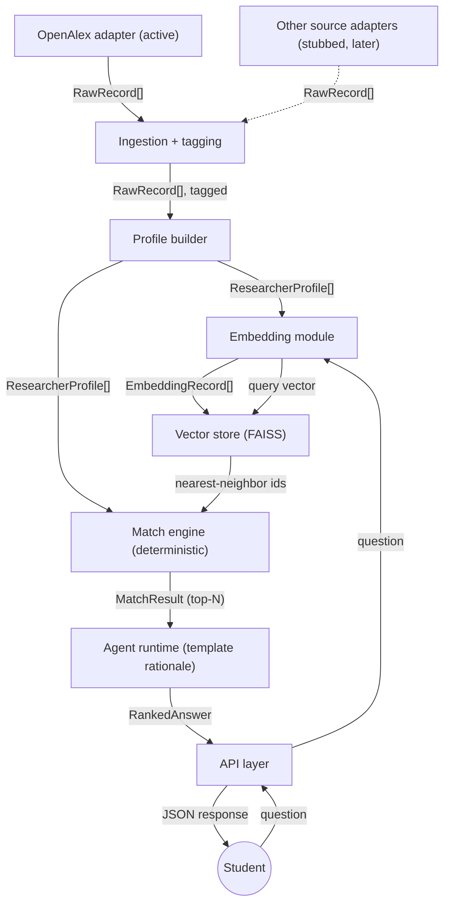

# Architecture

## System diagram

The student's question enters through the API layer and is embedded by the
same embedding module that embedded the researcher profiles at build time;
the query vector drives nearest-neighbor search in the vector store, and the
deterministic match engine turns the neighbors into a ranked `MatchResult`.
The agent runtime builds the grounded template rationale and the API returns
a `RankedAnswer`.

## Where the detail lives

- `docs/narrative.md` — the architecture narrative (what we built, cloud
  services, key decisions, evaluation design, upgrade paths).
- `docs/contracts.md` — the data contracts crossing every module boundary.
- `docs/evaluation.md` — the known-item evaluation design and results table.
- `deploy/README.md` — the Learner Lab deployment runbook.
